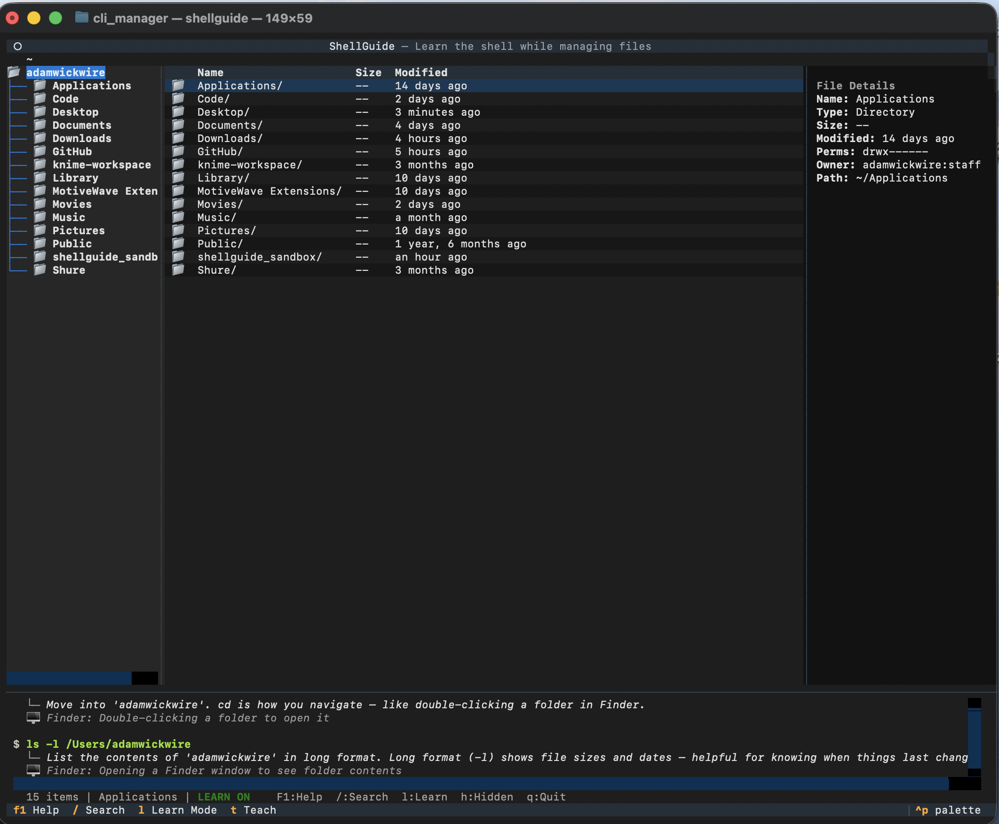
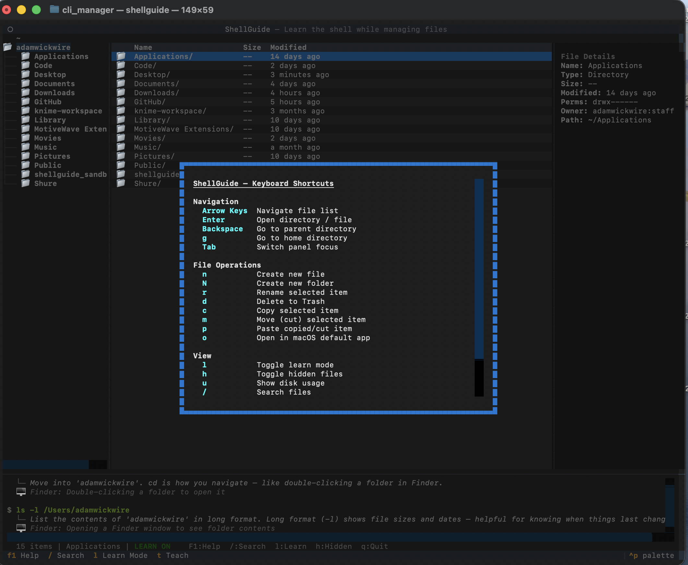
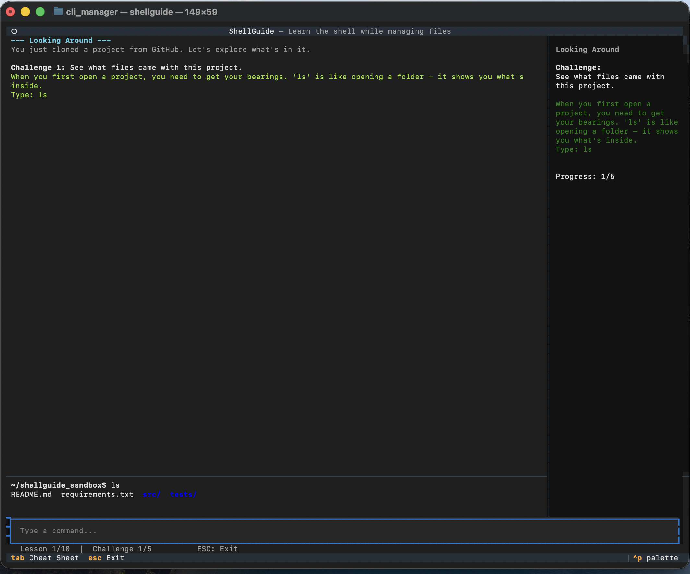

# ShellGuide

A terminal file manager that teaches you the shell as you use it. Every action you take — navigating, creating files, deleting, copying — shows the equivalent shell command and explains what it does.

  



## Quick Start

```bash
git clone https://github.com/WalrusQuant/shellguide.git
cd shellguide
python -m venv .venv
source .venv/bin/activate
pip install -e .
shellguide
```

## Prerequisites

- Python 3.10+
- macOS (uses `open` command, `~/.Trash/` for safe delete)

## Usage

### File Browser Mode

```bash
shellguide
```

A three-panel file manager with directory tree, file list, and info panel. When **Learn Mode** is on (default), every action logs the equivalent shell command with a plain-English explanation in the bottom panel.



**Keyboard shortcuts:**

| Key | Action |
|-----|--------|
| Arrow Keys | Navigate file list |
| Enter | Open directory / select file |
| Backspace | Go to parent directory |
| g | Go to home directory |
| n / N | New file / New folder |
| r | Rename |
| d | Delete (moves to Trash) |
| c / m / p | Copy / Cut / Paste |
| o | Open in default macOS app |
| u | Show disk usage |
| / | Search files |
| l | Toggle learn mode |
| h | Toggle hidden files |
| t | Switch to teach mode |
| F1 | Help |
| q | Quit |

### Teach Mode

```bash
shellguide --teach
```

Guided interactive lessons where you type real shell commands into a sandboxed directory (`~/shellguide_sandbox/`). The sandbox is created automatically and cleaned up when you exit.



**10 lessons covering:**
1. Looking Around (`ls`, `pwd`)
2. Navigation (`cd`, `..`)
3. Creating Files & Folders (`touch`, `mkdir`)
4. Renaming & Moving (`mv`)
5. Copying (`cp`, `cp -r`)
6. Deleting (`rm`, `rmdir`, `rm -r`)
7. Reading Files (`cat`, `head`, `tail`, `wc`)
8. Finding Things (`find`, `stat`)
9. Combining Commands (`&&`)
10. Real Workflows (multi-step tasks)

Each challenge validates your command, provides hints if you get stuck, and explains the right answer.

## Project Structure

```
src/shellguide/
├── app.py              # Textual App entry point
├── core/
│   ├── file_utils.py   # FileInfo dataclass, directory listing, search
│   ├── file_ops.py     # Safe file operations (shutil/pathlib)
│   ├── command_builder.py  # Shell command strings for display
│   ├── command_explainer.py  # Command reference data
│   ├── sandbox.py      # Teach mode sandbox lifecycle
│   ├── executor.py     # Sandboxed command execution
│   └── challenges.py   # Lesson content and validators
├── widgets/
│   ├── file_table.py   # Center panel file list
│   ├── file_tree.py    # Left panel directory tree
│   ├── file_info_panel.py  # Right panel file details
│   ├── command_log.py  # Learn mode command display
│   ├── breadcrumb.py   # Path breadcrumb bar
│   ├── status_bar.py   # Bottom status bar
│   └── challenge_panel.py  # Teach mode sidebar
├── screens/
│   ├── main_screen.py  # File browser screen
│   ├── teach_screen.py # Interactive lesson screen
│   ├── confirm_dialog.py
│   ├── input_dialog.py
│   ├── search_screen.py
│   └── help_screen.py
└── styles/
    └── app.tcss        # Textual CSS layout
```

## Tech Stack

- **[Textual](https://textual.textualize.io/)** — TUI framework for the terminal interface
- **[humanize](https://python-humanize.readthedocs.io/)** — Human-readable file sizes and timestamps
- **pathlib / shutil** — Safe filesystem operations (no shell commands executed in file browser mode)
- **[Hatchling](https://hatch.pypa.io/)** — Build backend


